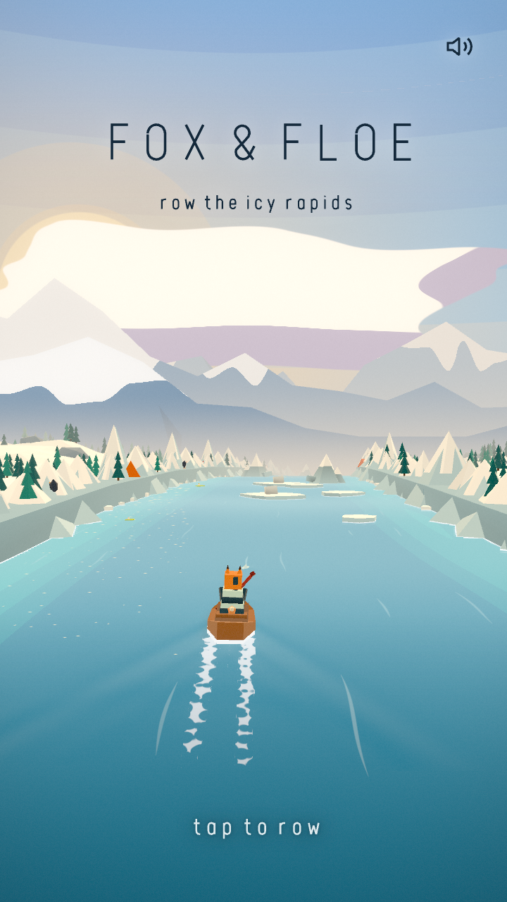

# Fox & Floe

Play it live: https://fox-floe-opus.vercel.app

A tiny endless river game. The river fills the screen, and a quiet interface of thin type
floats over it, in the spirit of Alto's Odyssey. Every 3D asset was modeled in Blender (via
the Blender MCP) and exported as one `assets.glb`. The game runs on Three.js in the browser,
fully offline once installed.



## Play

From the repo root, serve the folder with any static server and open it:

```bash
python3 -m http.server 8317
```

Then open http://localhost:8317. Modules and GLB loading need http, so opening `index.html`
straight from disk will not work.

The pre-redesign version is kept, playable, at http://localhost:8317/classic/.

## Controls

- Steer: `A` / `D`, the left / right arrows, or a mouse or touch drag. The drag counts from
  wherever the finger lands, not from the middle of the screen: that point is zero, and the boat
  moves by how far the finger moves from it (about 320 px of drag crosses the whole river). A quick
  swipe still lands after the finger lifts, and the next drag carries on from there. A quick tap
  or click only rows.
- Start / retry: `Up`, `Space`, `Enter`, or a tap on the river
- Row during a run: a quick tap, or a press of `Up` / `Space`, is one power stroke (a decaying
  speed surge). Hold `Space` or `Up` for a sustained pull: speed eases up and holds, the fox
  rows faster and leans in, the spray and wake build, and a rush of water rises in the mix,
  all easing off when you let go.
- `M` sound, `P` / `Esc` pause, `R` instant restart

## The interface

- **Type**: every word and number is drawn as SVG strokes in one monoline, condensed alphabet
  (`src/print.js`), so text looks the same on every device and no font files are needed. The
  icons (`src/icons.js`) use the same stroke grammar.
- **Ink that follows the sky**: text over the sky turns navy on bright skies and white at dusk
  and night. Text over the river or a dimmed scene stays white. Everything carries a soft halo
  so it stays readable over any frame.
- **In a run**: the score is centered at the top with the distance beneath it, and section
  calls (rapids, narrows, milestones, new best) fade in under both. On the first
  run a one-line hint on how to row appears there too, clear of the river. Fish and the chain
  multiplier, with a thin draining line, sit at the top left, with the shield and the golden
  fish when active. There is one pause glyph. Fish points, close calls, smashes and air float
  up from the boat.
- **Title**: the title writes itself in, stroke by stroke, while the fox rows itself and "tap
  to row" breathes below. Pressing row hands over the oar without resetting the river. The best
  score and meters rowed appear once there has been a run.
- **Results**: the points lead, then meters, fish and close calls, then best (or "new best"),
  while the Blender title-camera orbit circles the wreck.

## Rendering

- **Water** (`src/water.js`): a flat-ink surface shader. A half-float GPU buffer that scrolls
  with the world stores foam trails, a ripple wave simulation and shadows. The boat's twin
  wakes, oar strokes, splashes, fish trails and swimming penguins all write into it. Foam
  dissolves as lace: fresh foam is dense, and as it ages it opens into bubbles and then thin
  threads, so a patch of foam never reads as a floe. Splashes leave a ripple ring and only a
  fleck of foam. A depth prepass (full size on standard-density screens) draws shape-true foam
  lines wherever ice or banks meet the water. Rapids streak with whitewater, and glints sparkle on the sun or moon path. The surface curves over
  the horizon with the rest of the world.
- **Sky** (`src/sky.js`): posterized gradient bands, a crisp sun with halo rings, a crescent
  moon, stars, aurora curtains and flat two-tone clouds, plus three faceted mountain ranges
  with aerial haze.
- **World bend** (`src/bend.js`): every material is patched so the river swings left and right
  and drops over the horizon. Gameplay coordinates stay straight. The glTF materials are
  restyled at runtime into 3-step toon inks that keep the baked AO.
- **Snowfield** (`src/terrain.js`): faceted hills with merged pine stands and boulders beyond
  the cliffs, recycled as conveyor chunks over one world-anchored noise field (one rebuild per frame).
- **Palette** (`src/palette.js`): nine keyed moments from morning to dawn drive the sky, water,
  lights and fog.
- **Post** (`src/post.js`): the scene renders into one multisampled half-float target (2 samples on
  dense screens, 4 otherwise); a half-resolution bloom; then one final pass that adds the glow,
  grades, adds grain, vignette, flowing speed streaks and the crash color split, converts to sRGB
  and draws straight to the screen.
- **Performance**: each bank module's cliff, trees and tent are baked into one mesh (re-dressed one
  module per frame as they recycle), floes, bergs and lilies are single meshes, and the penguins
  that only stand on the banks are frozen, unskinned copies. The water shader skips its noise
  wherever the result cannot show. The resolution steps down a notch while frames miss 50 fps and
  back up after a few seconds at full rate. About 7.5 ms a frame at 1440x900 on a 2x screen (M1 Pro),
  down from 19.

## Rules

- Row down the icy canyon and dodge floes and icebergs. Hitting one ends the run.
- Penguins ride floes (sometimes up on the ice block, as lookouts) and watch you come. When
  you get close, one turns to face your line with a "wek wek", crouches, and hops into the
  river just off your line. Its shadow shows where it will land. It dives in head first, swims
  under, then porpoises across your lane, timed to cross your bow. Steer and it misses; hold
  your course and it hits. Touching one while it is out of the water ends the run.
- Scoop up fish: each is worth 25 points, and chains build a multiplier up to x5. A close call
  is worth +8. Score = meters + bonus.
- Power-ups: the thermos shield smashes through one hit, the golden fish is an 8-second magnet,
  and the driftwood ramp launches the boat over a floe line.
- River sections: calm water, narrows (the banks close in) and rapids. The original game also had
  side currents that pushed the boat sideways; they read as the boat steering itself, so they were
  removed (2026-09-24). Nothing moves the boat sideways except your steering.
- The river speeds up and gets denser over time. The best score and a lifetime river log
  (meters rowed, fish caught) are saved locally.

## Deploy

It is a static site with no build step, so any static host works. With the Vercel CLI, from the
repo root:

```bash
vercel deploy --prod
```

`.vercelignore` keeps the Blender sources and design working files out of the upload.

## Files

- `index.html`, `style.css`: the interface markup and styles
- `game.js`: the game loop, gameplay, camera and wiring
- `src/`: `ui.js` (states, HUD, menus), `print.js` (the drawn alphabet), `icons.js`,
  `water.js`, `sky.js`, `terrain.js`, `bend.js`, `palette.js`, `post.js`, `audio.js`
- `assets.glb`: all models and Blender clips (fox in a rowboat with an oar, penguin, fish, lily,
  3 floes, iceberg, 2 cliff bank modules, 2 pines, tent, campfire, splashes, power-ups)
- `vendor/`: Three.js r164 and the example modules the game uses (no CDN)
- `sfx/`: CC0 sounds, see `sfx/CREDITS.md`
- `classic/`: the previous version, still playable
- `blender/foxfloe.blend`: the Blender source
- `PRODUCT.md`, `DESIGN.md`: product record and the documented design system

## Blender-first animation

The fox and penguin are rigged in Blender, and their animation is Blender actions played
through three.js AnimationMixer: `FoxRow`, `ScarfWave`, `PengIdle` / `PengCrouch` / `PengFly`,
and `TitleCamMove`, which now drives the results orbit. Penguin flight and swimming are
ballistic, computed on the body's center, and the body follows its velocity: stretch on
takeoff, head-first entries, belly-down porpoise arcs, with PengFly driving the flippers. Ambient occlusion is baked into vertex
colors for all gameplay meshes. Skinned clones go through SkeletonUtils.

## License

The game's code and its own art (the models in `assets.glb` and `blender/`, the renders and
icons) are MIT licensed, see `LICENSE`. Three.js in `vendor/` and `textures/waternormals.jpg`
come from the Three.js project (MIT, Three.js Authors). The sounds are CC0, credited in
`sfx/CREDITS.md`.
